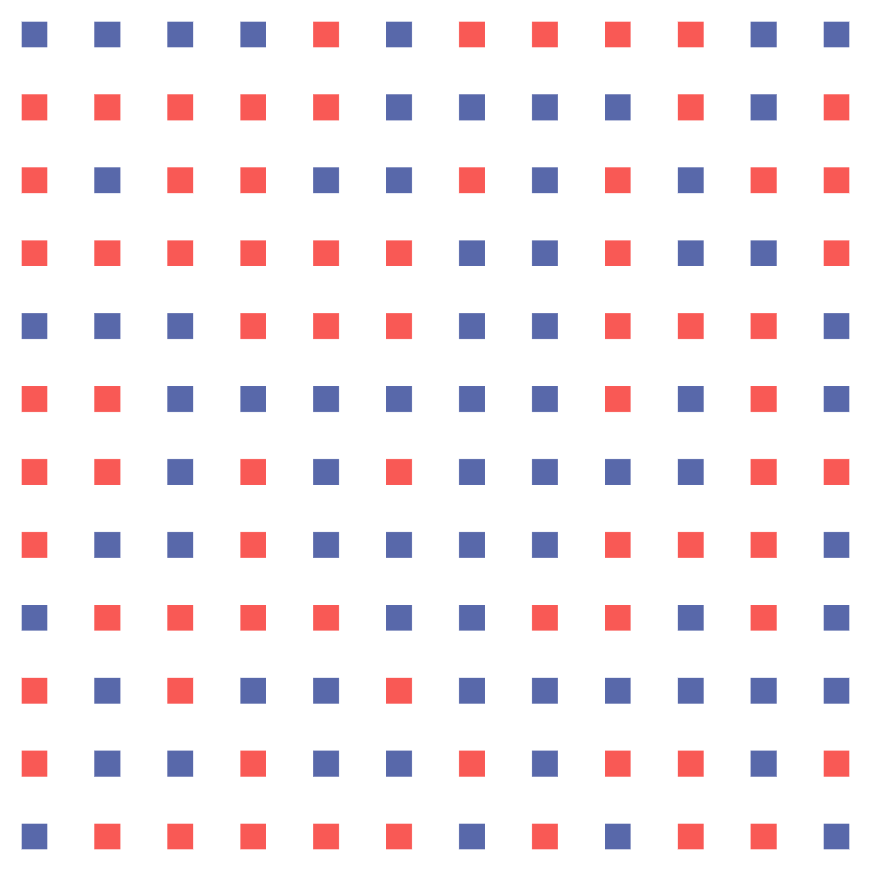
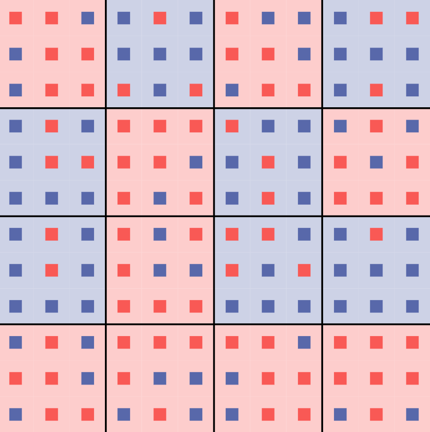
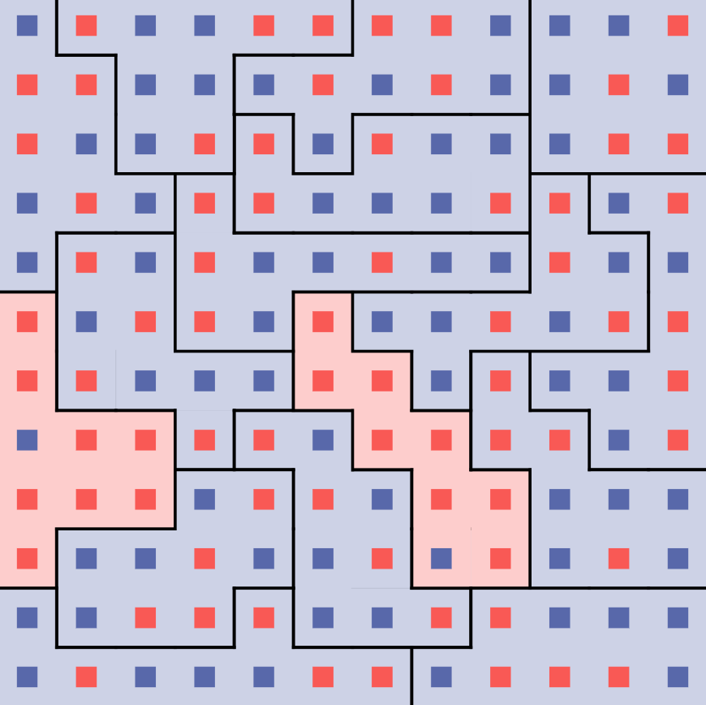
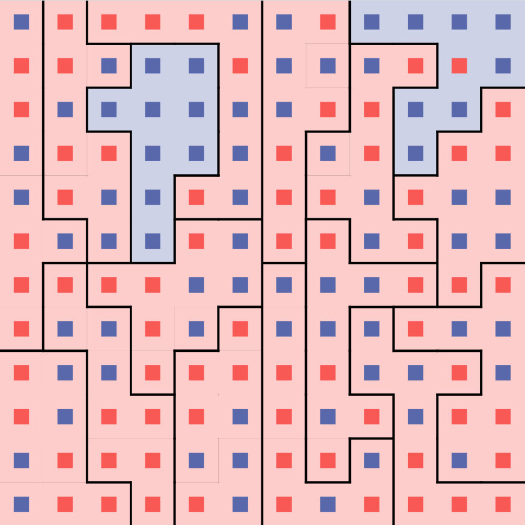
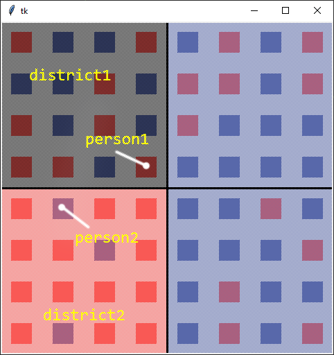
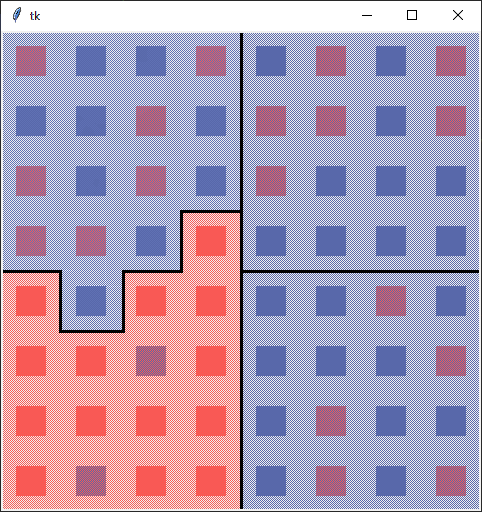

# [Gerrymandering](https://mazore.github.io/gerrymandering-js)

A program that draws district lines around a two-party grid of people in order to give an unfair advantage to one party. It's purpose is to educate people about how much drawing district lines can affect the representation of a population.

Live demo link: https://mazore.github.io/gerrymandering-js

Python version (original): https://github.com/mazore/gerrymandering

## Usage

**Drag** the yellow dot on the "district" (right side) pie chart to gerrymander and change the proportions of districts. This will redraw district lines to make one party more or less favored in representation.

Small red/blue squares represent people who get one vote for whatever party color they are. Then district lines are drawn around groups of people and the district backgrounds are colored by which party wins the district.

You can also drag the yellow dot on the "population" pie chart to change how many people vote for a certain party. "People per District" and "Number of District" sliders can also be adjusted.

## Explanation

</img>

Above is a grid of people, each colored by which party they vote for. There are 72 blue people and 72 red people.

</img>

Districts are groups of people (9 people in this case) enclosed in black lines, shaded by winner (which party has more
people in the district).

</img>

We can draw the district lines in such a way that gives blue 14 districts and red only 2.

</img>

This is the **same people** but with lines drawn so that red has 14 districts and blue only has 2.

## How It Works

### Overview

First, a grid of people is generated, with parties that are randomized while ensuring that there are an equal amount of
people in each party. Districts are then drawn around those people. Districts are initially squares of size
`district_size`, and we ensure that `grid_width` and `district_width` allow this to be possible. From there, we perform
a series of swaps of people between districts. These swaps will over time give one party (specified by `help_party`)
more and more districts, without changing the people grid.

### Swapping
We pick 2 districts, `district1` and `district2` that are touching by 2 or more people. We also pick a person from each
of those districts (`person1` and `person2`), using certain conditions to ensure that the swap not hinder the wrong
party or cause disconnections in the districts. More information about these conditions can be found in `get_person1`
and `get_person2` methods in `simulation/swap_manager.py`.

We can then make `person1` part of `district2`, and `person2` part of `district1`.

In this example, we have flipped one district from being tied to being blue.

## Roadmap & Contributing
PR's, feedback, and general insight are much appreciated. TODO's can be found in `todo.txt`.
